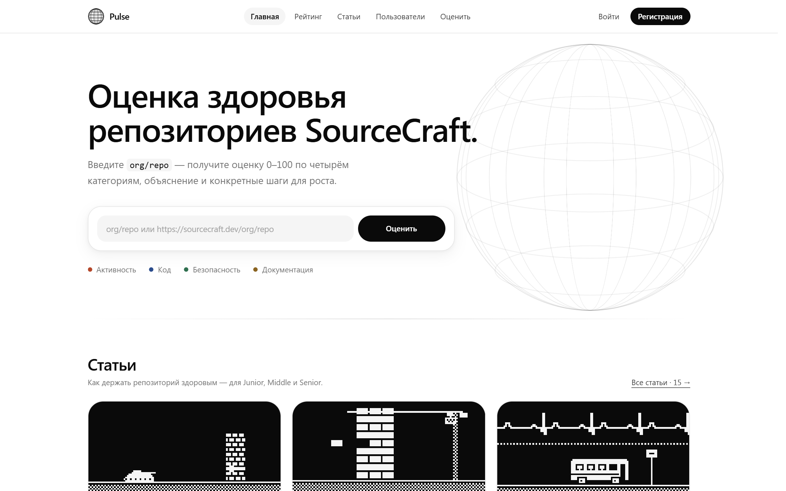
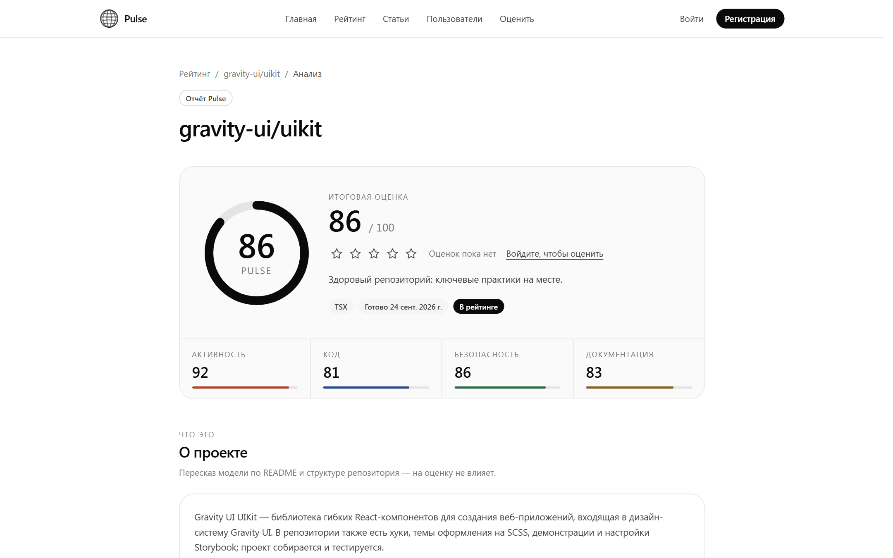
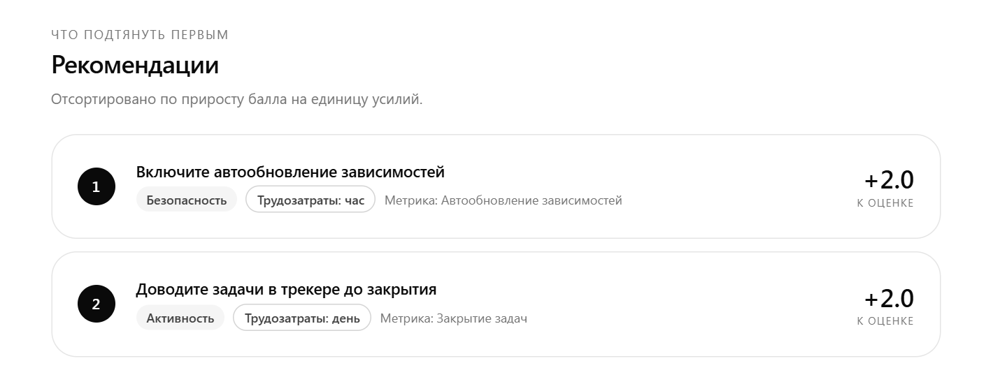
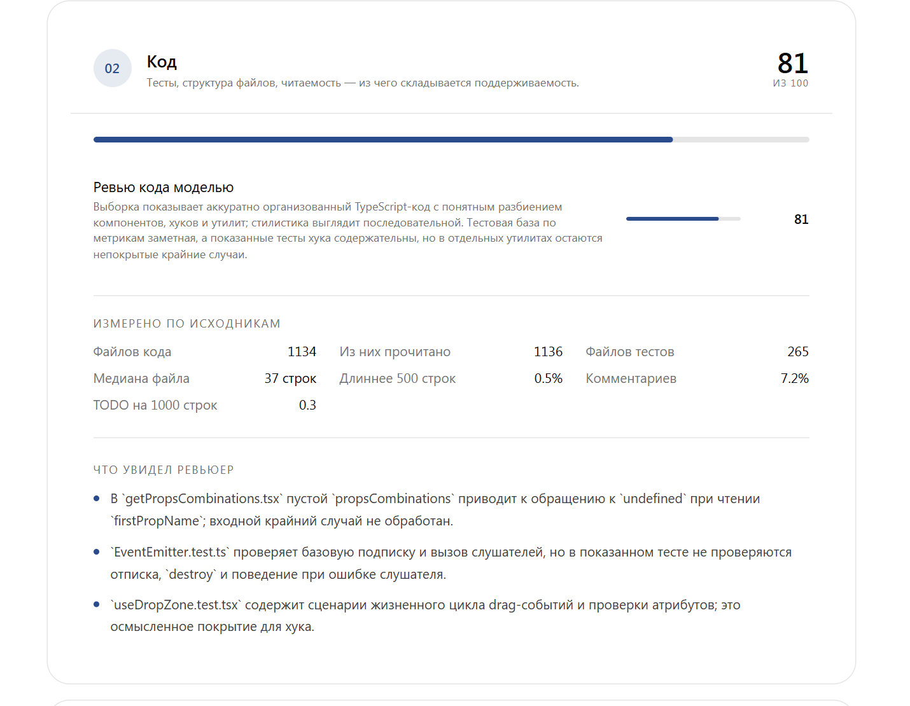
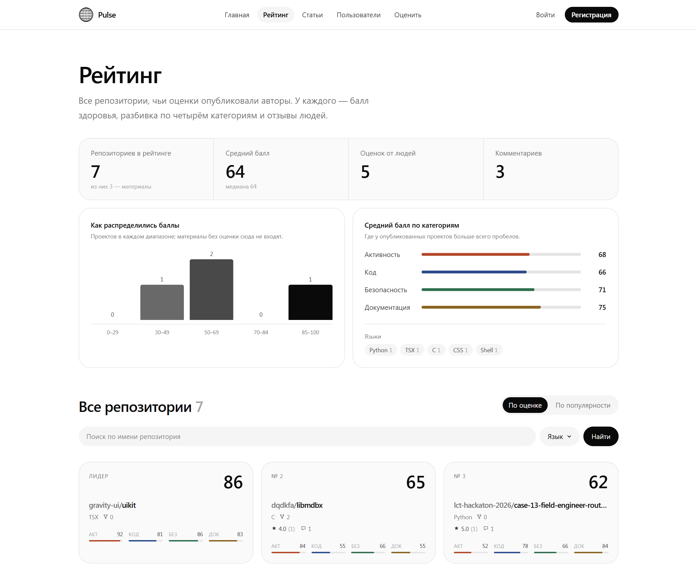
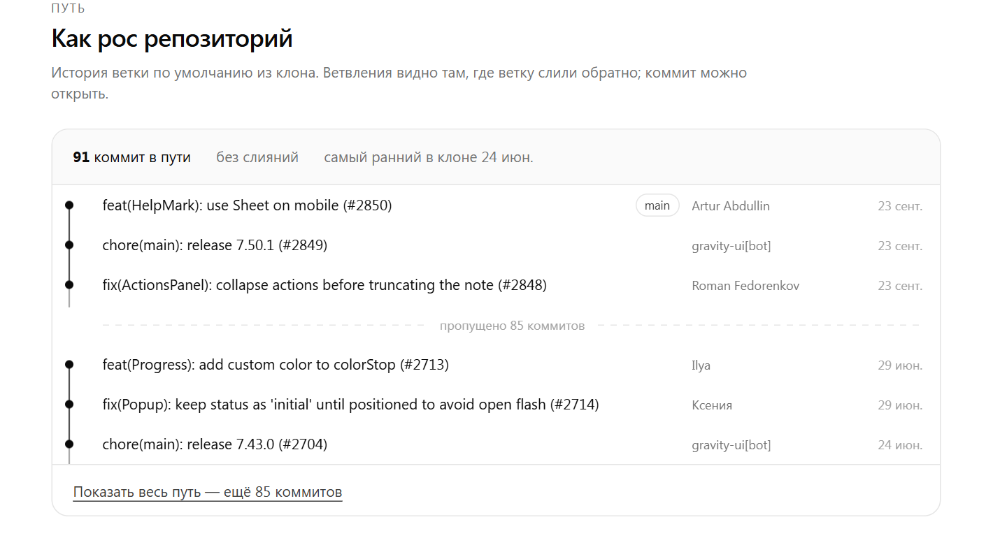
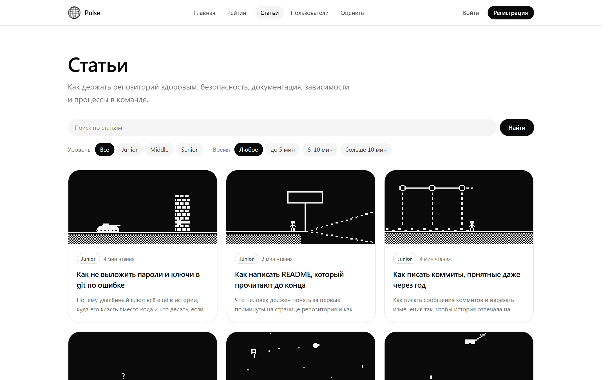
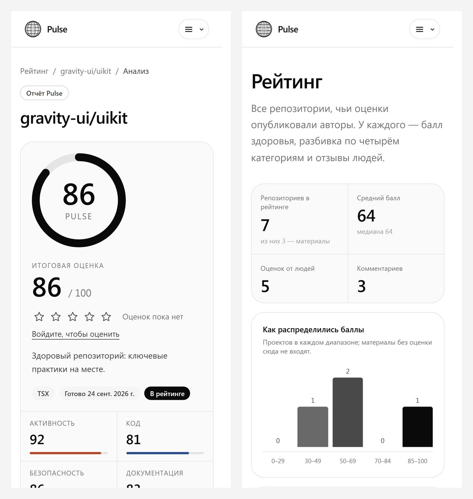
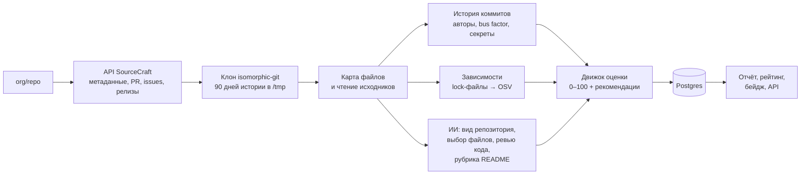

# Pulse


**Оценка здоровья открытых репозиториев SourceCraft**

Вводите `org/repo` и получаете Repo Health Score от 0 до 100, объяснение по каждой метрике,
рекомендации с ожидаемым приростом балла и место в общем рейтинге.

### 🔗 [source-craft-pulse.vercel.app](https://source-craft-pulse.vercel.app)

[](https://i.moscow/hackaton/lct/67f958a876bc4beb8081c34bdf78745c)
[](https://nextjs.org)
[](https://www.typescriptlang.org)
[](https://neon.tech)
[](https://source-craft-pulse.vercel.app)

</div>

  [https://github.com/user-attachments/assets/1a2b3c4d-....](https://github.com/user-attachments/assets/43c152ea-81cd-4412-a9fc-8416caf37a7f)

<div align="center">

---

## Задача

> **Кейс 18 · Сервис оценки здоровья открытых репозиториев SourceCraft**
> Хакатон «Лидеры цифровой трансформации» 2026 · номинация «Наука» · заказчик — SourceCraft (Яндекс)

Тимлидам, CTO и мейнтейнерам сложно быстро понять состояние репозитория: сигналы разбросаны
между git-историей, CI, README, issues, merge requests и зависимостями. Pulse сводит их в одну
понятную оценку, объясняет её и подсказывает, что сделать в первую очередь.

| Требование кейса | Как сделано в Pulse |
|---|---|
| Repo Health Score 0–100 | Четыре равные категории: активность, код, безопасность, документация. Внутри около 30 метрик и штрафы за грубые ошибки |
| Объяснение оценки | Каждая метрика показывает своё значение, балл и откуда он взялся. Где данных нет, прямо написано «нет данных» |
| Конкретные рекомендации | До девяти шагов, отсортированных по приросту балла на единицу усилий. Прирост для каждого шага считается симуляцией |
| Простая страница рейтинга | [/rating](https://source-craft-pulse.vercel.app/rating): подиум, поиск, фильтр по языку, сортировка по оценке и популярности |
| ⭐ Расширенный публичный рейтинг | Сводка по рейтингу, распределение баллов, средние по категориям, языки, оценки людей и комментарии |
| ⭐ Дополнительные возможности | ИИ-ревью кода, история коммитов, SVG-бейдж для README, публичный API, статьи, профили, админка |

## Команда

| | Роль |
|---|---|
| **Стрельников Михаил** | Fullstack-разработчик |
| **Лесунов Илья** | Fullstack-разработчик |

## Как шла разработка

Разработка шла поэтапно **с 16 по 28 сентября 2026 года**. После каждого этапа сервис оставался
рабочим, и каждый этап попадал в историю отдельным коммитом.

| Этапы | Что появилось |
|---|---|
| 1–4 | каркас, схема БД и деплой; клиент API SourceCraft и сбор фактов; движок оценки с тестами; слой ИИ с кэшем и бюджетом |
| 5–8 | вход и лимиты, публикация и рейтинг, публичный API и бейдж, админка, ЧБ-дизайн |
| 9–13 | анализ прямо в запросе Vercel, isomorphic-git, категория «Код» по исходникам и ИИ-ревью, дерево коммитов |
| 14–22 | ускорение сбора и работа с большими репозиториями, жанр «полезный материал», живые фазы анализа, новый рейтинг |
| 23–34 | профили, оценки и комментарии, рекомендации по приросту, статьи, вкладка «Пользователи», вход через Яндекс ID, мобильная вёрстка |

## Скриншоты

<table>
  <tr>
    <td width="50%"><br/><sub><b>Главная</b>: форма оценки и подборка статей</sub></td>
    <td width="50%"><br/><sub><b>Отчёт</b>: итоговый балл и четыре категории</sub></td>
  </tr>
  <tr>
    <td><br/><sub><b>Рекомендации</b>: прирост балла, трудозатраты и метрика, на которую влияет шаг</sub></td>
    <td><br/><sub><b>Код</b>: ревью модели рядом с числами, измеренными по исходникам</sub></td>
  </tr>
  <tr>
    <td><br/><sub><b>Рейтинг</b>: сводка, распределение баллов и подиум</sub></td>
    <td><br/><sub><b>Как рос репозиторий</b>: путь коммитов из клона</sub></td>
  </tr>
  <tr>
    <td><br/><sub><b>Статьи</b>: 15 разборов для уровней Junior, Middle и Senior</sub></td>
    <td><br/><sub><b>Мобильная версия</b>: отчёт и рейтинг на экране 393 px</sub></td>
  </tr>
</table>

## Как считается оценка

Итог складывается из четырёх категорий с равными весами (по 25 %). Метрики, по которым нет данных,
не обнуляют категорию: они исключаются, а их вес делится между остальными.

| Категория | Что смотрим |
|---|---|
| **Активность** | коммиты за 90 дней, активные авторы, свежесть последнего коммита, bus factor, релизы и теги, поток pull request, закрытие задач |
| **Код** | тесты на 100 файлов, доля файлов длиннее 500 строк, комментарии, TODO/FIXME на 1000 строк, линтер, CI, манифест сборки, `.gitignore`, `.editorconfig` и **ИИ-ревью** выборки файлов |
| **Безопасность** | critical, high и medium уязвимости зависимостей по базе [OSV](https://osv.dev), lock-файлы, свежесть зависимостей, Dependabot или Renovate |
| **Документация** | README по рубрике модели (структура, установка, примеры, описание API), а также LICENSE, CONTRIBUTING, CHANGELOG, `docs/`, шаблоны задач, code of conduct и описание репозитория |

**Штрафы** снимаются поверх суммы: −15 за секрет в git-истории, −10 за critical-уязвимость
без исправления, −8 за отсутствие LICENSE.

**Рекомендации** движок подбирает симуляцией: для каждой слабой метрики он считает, насколько
вырастет итог, если её исправить, и делит прирост на трудозатраты (час, день, неделя).
Так в начале списка оказывается то, что даёт больше всего за меньшие усилия.

**Не всякий репозиторий — программа.** Подборки ссылок, конспекты и шпаргалки распознаются
эвристикой и моделью. Для них вместо оценки Pulse пишет «Полезный материал» и рассказывает, о чём он.

## Как проходит анализ

На странице ожидания видны настоящие фазы прогона: сервер записывает текущую фазу в базу,
поэтому после обновления страницы прогресс не начинается заново.



1. **Встали в очередь**: одна задача на репозиторий, лок защищает от двух параллельных прогонов.
2. **Опрашиваем API SourceCraft**: метаданные, pull request, задачи, релизы.
3. **Клонируем репозиторий**: [isomorphic-git](https://isomorphic-git.org), потому что в serverless нет бинарника git; одна ветка, окно 90 дней, клон удаляется сразу после анализа.
4. **Строим карту файлов**: индекс «путь → объект» за один обход дерева.
5. **Читаем исходники**: до тысячи файлов по кругу из всех каталогов, пачками и с дедлайном.
6. **Разбираем историю коммитов**: авторы, ритм, ветки и регулярки для поиска секретов в диффах.
7. **Проверяем зависимости**: разбор `package-lock.json` и `pnpm-lock.yaml`, запрос уязвимостей в OSV.
8. **Модель читает код**: сначала выбирает файлы по структуре проекта, потом оценивает их содержимое.
9. **Считаем оценку**: движок покрыт тестами Vitest.

Весь прогон укладывается в одну функцию Vercel (до 300 с с Fluid compute), отдельный воркер в проде не нужен.

## Бейдж и публичный API

Опубликованный анализ можно вставить в README репозитория:

[](https://source-craft-pulse.vercel.app/r/gravity-ui/uikit)

```markdown
[](https://source-craft-pulse.vercel.app/r/<org>/<repo>)
```

| Метод | Что возвращает |
|---|---|
| `GET /api/public/leaderboard` | рейтинг опубликованных репозиториев (с ограничением частоты запросов) |
| `GET /api/public/repos/<org>/<repo>` | последний публичный анализ репозитория |
| `GET /api/badge/<org>/<repo>.svg` | SVG-бейдж с баллом |

## Честно о данных

Pulse берёт только то, что реально отдаёт [API SourceCraft](https://sourcecraft.dev) и сам
репозиторий. Если сигнала нет, интерфейс пишет «нет данных», а не подставляет значение.
В публичном API нет эндпоинтов файлов, коммитов и результатов AppSec-сканирования. Поэтому код
и историю мы читаем из клона, уязвимости проверяем по открытой базе OSV, а провайдер AppSec
сейчас подключён заглушкой и не влияет на оценку.

**Публичная оценка и личная.** Публичный рейтинг, бейджи и страницы репозиториев строятся
только на данных, которые SourceCraft отдаёт любому. То, что доступно лишь участникам
репозитория, — CI-прогоны и приватные репозитории — Pulse получает по личному токену
владельца в разделе «Мои репозитории», показывает только ему и в публичный балл не включает.

**Приватные репозитории.** Оцениваются правами токена владельца, никогда не публикуются: их
нет в рейтинге, бейдже и на публичных страницах. Их код не отправляется ни во внешнюю
ИИ-модель, ни в базу уязвимостей.

**Хранение.** Код в базе не хранится: репозиторий клонируется во временный каталог на время
анализа и удаляется сразу после него. Личные токены SourceCraft хранятся только
зашифрованными (AES-256-GCM) и удаляются кнопкой «Отключить» в настройках.

**Лимиты API.** Запросы к `api.sourcecraft.tech` идут не чаще 8 в секунду при лимите 10.

## Стек

| Слой | Технологии |
|---|---|
| Приложение | Next.js 15 (App Router), TypeScript strict, Tailwind CSS, свои компоненты без UI-китов |
| Данные | Postgres на Neon, Drizzle ORM и drizzle-kit, Zod на всех внешних данных |
| Анализ | isomorphic-git, OSV API, OpenAI-совместимый роутер (RouterAI) с кэшем, учётом расходов и месячным бюджетом |
| Вход | Auth.js v5: почта и пароль (argon2), Яндекс ID |
| Качество | Vitest на движке оценки и парсерах, ESLint |
| Хостинг | Vercel Hobby с Fluid compute |

## Запуск локально

Нужны Node.js ≥ 20, pnpm ≥ 10, база Postgres (подойдёт бесплатный [Neon](https://neon.tech)),
токен SourceCraft `SOURCECRAFT_PAT` и ключ ИИ-роутера (`AI_BASE_URL`, `AI_API_KEY`, `AI_MODEL`).

```bash
pnpm install
cp .env.example .env   # заполните DATABASE_URL, SOURCECRAFT_PAT, AI_* и AUTH_SECRET (TOKEN_ENCRYPTION_KEY — по желанию)
pnpm db:migrate
pnpm dev               # http://localhost:3000
```

<details>
<summary><b>Все команды</b></summary>

| Команда | Что делает |
|---|---|
| `pnpm dev` / `pnpm build` / `pnpm start` | разработка, прод-сборка (с миграциями), запуск сборки |
| `pnpm typecheck` / `pnpm lint` / `pnpm test` | TypeScript, ESLint, Vitest |
| `pnpm collect <org> <repo> [--score] [--ai]` | собрать факты о репозитории из консоли и при желании сразу посчитать оценку |
| `pnpm worker` | вручную прогнать очередь `analysis_jobs` |
| `pnpm seed:repos [--auto] [--count=N]` | поставить репозитории в очередь |
| `pnpm db:generate` / `pnpm db:migrate` / `pnpm db:push` | миграции Drizzle |
| `pnpm gen:api` | обновить типы из OpenAPI SourceCraft |
| `pnpm ai:ping` | проверить ИИ-роутер и кэш |
| `pnpm admin:hash` | сгенерировать хэш пароля администратора |

Проверка соединения с базой: `curl http://localhost:3000/api/health` → `{"status":"ok","db":"ok"}`.

</details>

<details>
<summary><b>Деплой на Vercel</b></summary>

1. Создайте проект на [neon.tech](https://neon.tech) и возьмите **pooled**-строку подключения (хост с `-pooler`, `?sslmode=require`). Это `DATABASE_URL`.
2. Импортируйте репозиторий на [vercel.com/new](https://vercel.com/new). Миграции применятся сами перед сборкой.
3. Задайте переменные: `DATABASE_URL`, `AUTH_SECRET`, `NEXTAUTH_URL`, `AUTH_TRUST_HOST=true`, `SOURCECRAFT_PAT`, `AI_BASE_URL`, `AI_API_KEY`, `AI_MODEL`, `AI_MONTHLY_BUDGET_RUB`, `ADMIN_LOGIN`, `ADMIN_PASSWORD_HASH`, `CRON_SECRET`, а для входа через Яндекс ID ещё `AUTH_YANDEX_ID` и `AUTH_YANDEX_SECRET`.
4. Проверьте, что включён **Fluid compute**: без него функция оборвётся раньше 300 секунд.
5. Cron на Hobby срабатывает не чаще раза в сутки, поэтому `/api/cron/*` вызывает внешний планировщик с заголовком `Authorization: Bearer $CRON_SECRET`.
6. Суточный пересчёт своих репозиториев: внешний планировщик в 00:00 (по `BADGE_REFRESH_TZ`, по умолчанию Europe/Moscow) вызывает `POST /api/cron/refresh-badges` с тем же заголовком. Если прогонов много и функция не успела — повторный вызов в те же сутки досчитает остаток. В docker-развёртывании это делает воркер сам.
7. Автосинхронизация «Моих репозиториев»: внешний планировщик раз в 5 минут вызывает `POST /api/cron/sync-tokens` с тем же заголовком. Токены пользователей шифруются ключом `TOKEN_ENCRYPTION_KEY` (`openssl rand -base64 32`), без него — ключом из `AUTH_SECRET`.

</details>

## Структура

```
src/
├── app/                 # маршруты App Router: отчёт /a/[id], рейтинг, статьи, профили, админка, API
├── lib/
│   ├── collect.ts       # сбор фактов о репозитории
│   ├── scoring/         # движок оценки: метрики, веса, рекомендации и тесты
│   ├── git/             # клон, карта файлов, история, поиск секретов
│   ├── security/        # lock-файлы и OSV
│   ├── ai/              # роутер, кэш, бюджет и задачи модели
│   ├── sourcecraft/     # клиент API и типы из OpenAPI
│   └── learn/           # статьи
├── db/                  # схема Drizzle и миграции
└── worker/              # ручной прогон очереди
```

<div align="center">
<sub>Хакатон ЛЦТ 2026 · 16–28 сентября · Стрельников Михаил и Лесунов Илья</sub>
</div>
