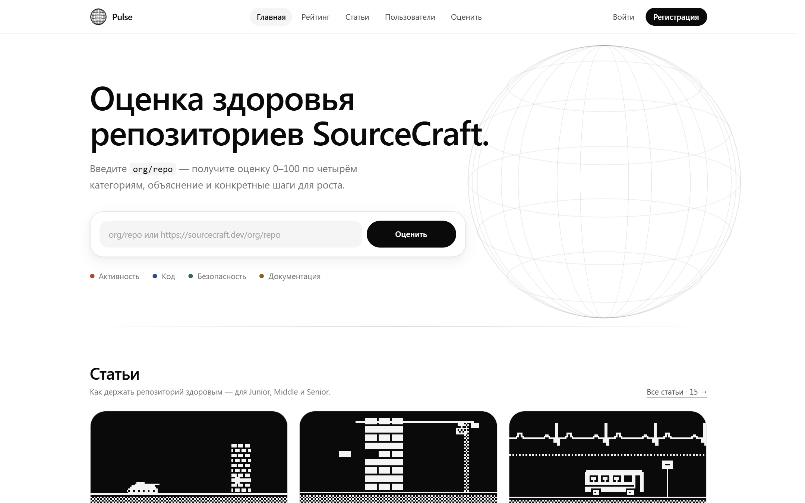
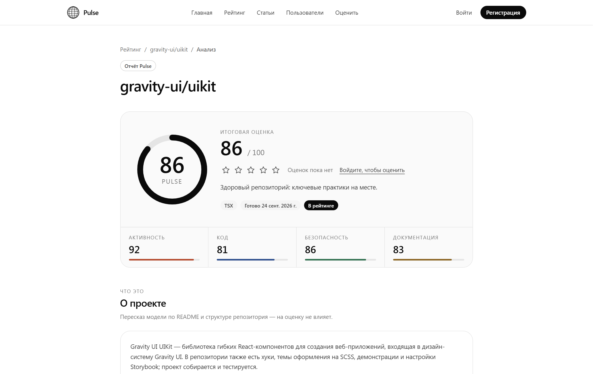
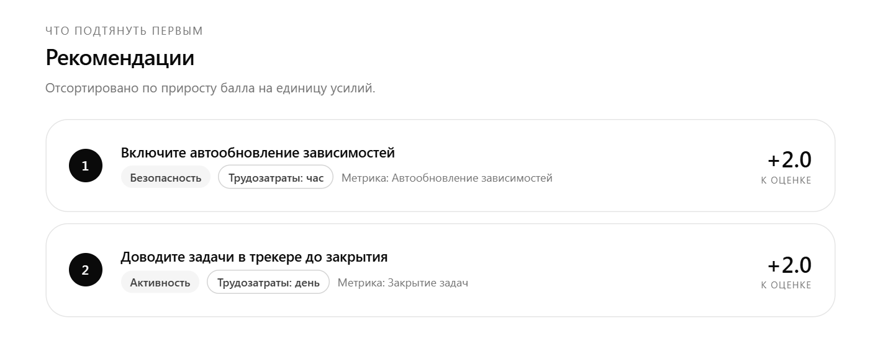
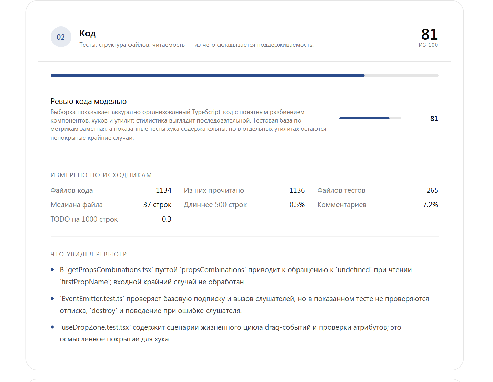
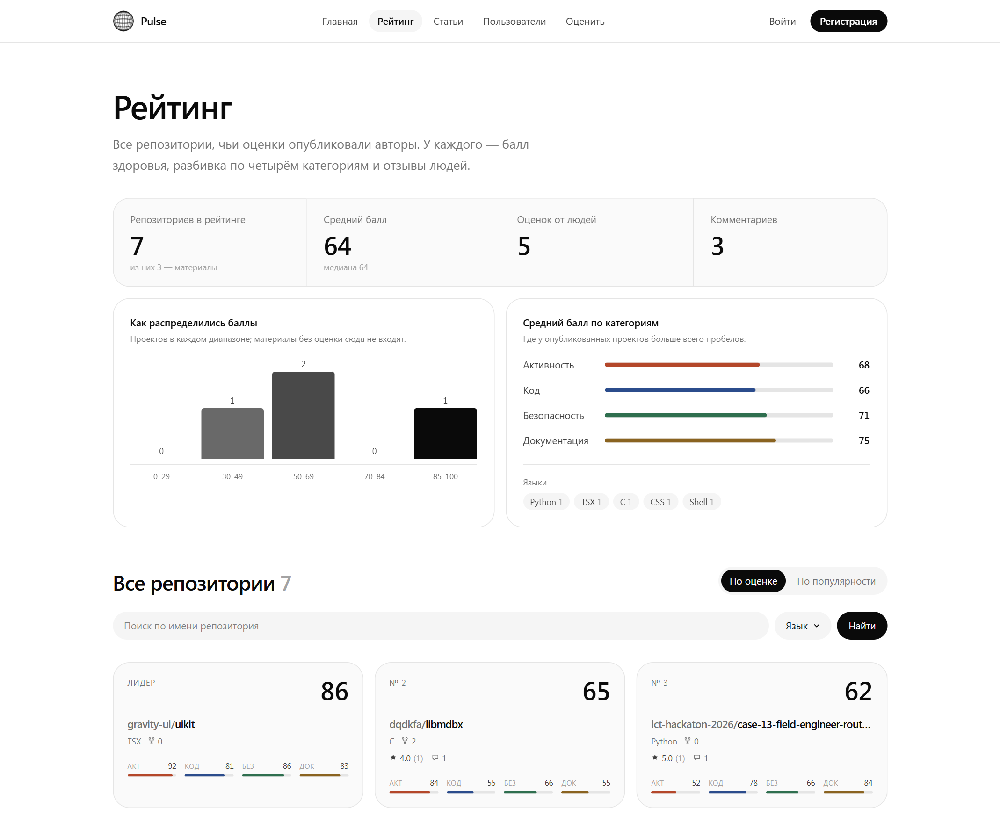
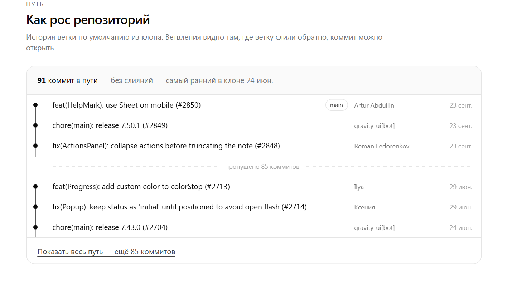
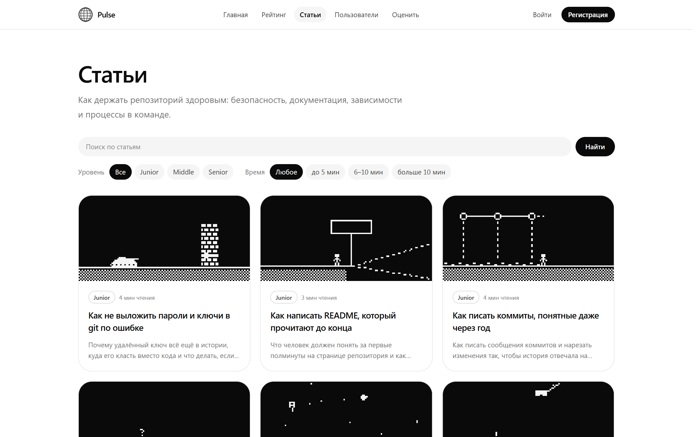
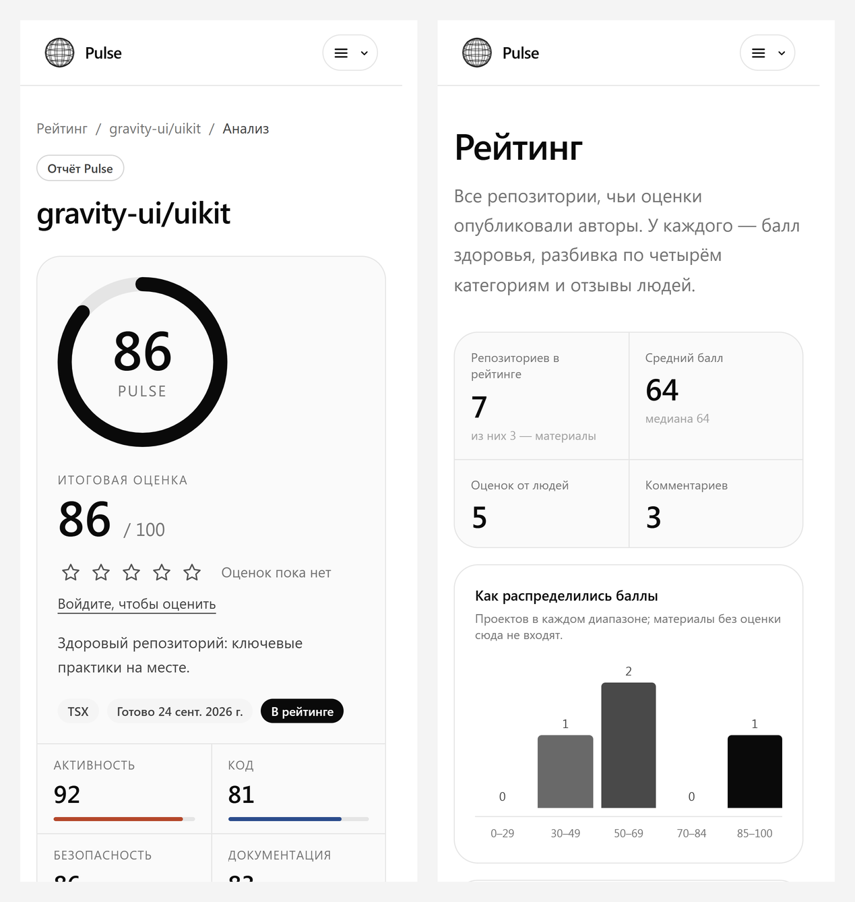
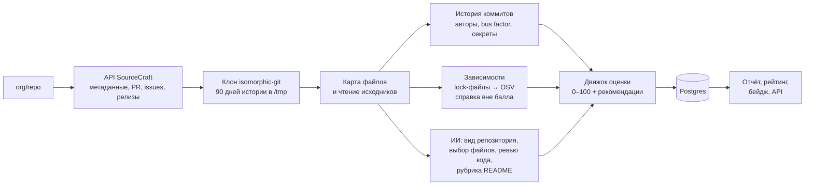

# Pulse


**Оценка здоровья открытых репозиториев SourceCraft**

Вводите `org/repo` и получаете Repo Health Score от 0 до 100, объяснение по каждой метрике,
рекомендации с ожидаемым приростом балла и место в общем рейтинге.

### 🔗 [source-craft-pulse.vercel.app](https://source-craft-pulse.vercel.app)

[](https://i.moscow/hackaton/lct/67f958a876bc4beb8081c34bdf78745c)
[](https://nextjs.org)
[](https://www.typescriptlang.org)
[](https://neon.tech)
[](https://source-craft-pulse.vercel.app)

</div>

  [https://github.com/user-attachments/assets/1a2b3c4d-....](https://github.com/user-attachments/assets/43c152ea-81cd-4412-a9fc-8416caf37a7f)

<div align="center">

---

## Задача

> **Кейс 18 · Сервис оценки здоровья открытых репозиториев SourceCraft**
> Хакатон «Лидеры цифровой трансформации» 2026 · номинация «Наука» · заказчик — SourceCraft (Яндекс)

Тимлидам, CTO и мейнтейнерам сложно быстро понять состояние репозитория: сигналы разбросаны
между git-историей, CI, README, issues, merge requests и зависимостями. Pulse сводит их в одну
понятную оценку, объясняет её и подсказывает, что сделать в первую очередь.

| Требование кейса | Как сделано в Pulse |
|---|---|
| Оценка по шести категориям | Безопасность, код, активность, документация, CI/CD, задачи — веса 20/20/15/15/15/15, как в ориентире ТЗ. Внутри около 40 метрик и штрафы за грубые ошибки |
| Repo Health Score с объяснением | Каждая метрика показывает балл и подсказку, откуда он взялся. «Нет данных» не штрафует: вес уходит измеренным, рядом с баллом — покрытие данных. Блок «Сильные и слабые стороны» |
| Приоритизированные рекомендации | До 12 шагов: проблема, почему важна, что измерено сейчас, как сделать под стек проекта, приоритет, трудозатраты и прирост балла (симуляцией) |
| Рейтинг открытых репозиториев | [/rating](https://source-craft-pulse.vercel.app/rating): место, название, ссылка, балл, лайки SourceCraft, язык, последняя активность; фильтр по языку, сортировка по баллу, лайкам и активности. Каталог — весь `GET /repos` |
| Анализ своего репозитория | Вход через Яндекс ID, личный токен SourceCraft, список доступных репозиториев, запуск оценки, отчёт. Приватные — только владельцу |
| Периодический пересчёт | Каталог обходится раз в сутки, устаревшие и изменившиеся публичные оценки пересчитываются, свои репозитории — каждую ночь |
| Выгрузка отчёта | Markdown, PDF и PNG со страницы анализа |

## Команда

| | Роль |
|---|---|
| **Стрельников Михаил** | Fullstack-разработчик |
| **Лесунов Илья** | Fullstack-разработчик |

## Как шла разработка

Разработка шла поэтапно **с 16 по 28 сентября 2026 года**. После каждого этапа сервис оставался
рабочим, и каждый этап попадал в историю отдельным коммитом.

| Этапы | Что появилось |
|---|---|
| 1–4 | каркас, схема БД и деплой; клиент API SourceCraft и сбор фактов; движок оценки с тестами; слой ИИ с кэшем и бюджетом |
| 5–8 | вход и лимиты, публикация и рейтинг, публичный API и бейдж, админка, ЧБ-дизайн |
| 9–13 | анализ прямо в запросе Vercel, isomorphic-git, категория «Код» по исходникам и ИИ-ревью, дерево коммитов |
| 14–22 | ускорение сбора и работа с большими репозиториями, жанр «полезный материал», живые фазы анализа, новый рейтинг |
| 23–34 | профили, оценки и комментарии, рекомендации по приросту, статьи, вкладка «Пользователи», вход через Яндекс ID, мобильная вёрстка |

## Скриншоты

<table>
  <tr>
    <td width="50%"><br/><sub><b>Главная</b>: форма оценки и подборка статей</sub></td>
    <td width="50%"><br/><sub><b>Отчёт</b>: итоговый балл и категории</sub></td>
  </tr>
  <tr>
    <td><br/><sub><b>Рекомендации</b>: прирост балла, трудозатраты и метрика, на которую влияет шаг</sub></td>
    <td><br/><sub><b>Код</b>: ревью модели рядом с числами, измеренными по исходникам</sub></td>
  </tr>
  <tr>
    <td><br/><sub><b>Рейтинг</b>: сводка, распределение баллов и подиум</sub></td>
    <td><br/><sub><b>Как рос репозиторий</b>: путь коммитов из клона</sub></td>
  </tr>
  <tr>
    <td><br/><sub><b>Статьи</b>: разборы для уровней Junior, Middle и Senior</sub></td>
    <td><br/><sub><b>Мобильная версия</b>: отчёт и рейтинг на экране 393 px</sub></td>
  </tr>
</table>

## Как считается оценка

Итог складывается из шести категорий ТЗ. Метрики и категории, по которым нет данных, не
обнуляют оценку: они исключаются, а их вес делится между остальными. Рядом с баллом страница
показывает **покрытие** — какая доля весов реально измерена. Полная методика с весами каждой
метрики — на странице [`/methodology`](https://source-craft-pulse.vercel.app/methodology).

| Категория | Вес | Что смотрим |
|---|---:|---|
| **Безопасность** | 20 % | только открытые находки [SourceCraft AppSec](https://appsec.sourcecraft.tech): critical, high, medium и секреты. AppSec отдаёт результаты лишь участникам репозитория, поэтому у публичных репозиториев категория — «нет данных» у всех одинаково (владелец видит находки и личный балл отдельно); приватный считается по токену владельца, если у него подключено платное дополнение безопасности SourceCraft — без него приватные репозитории AppSec не сканирует |
| **Код** | 20 % | тесты на 100 файлов, доля файлов длиннее 500 строк, комментарии, TODO/FIXME на 1000 строк, линтер, манифест сборки, `.gitignore`, `.editorconfig`, lock-файл, Dependabot или Renovate и **ИИ-ревью** выборки файлов |
| **Активность** | 15 % | коммиты за 90 дней, активные авторы, свежесть последнего коммита, bus factor, релизы и теги, поток pull request |
| **Документация** | 15 % | README по рубрике модели (структура, установка, примеры, описание API), а также LICENSE, CONTRIBUTING, CHANGELOG, `docs/`, шаблоны задач, code of conduct и описание репозитория |
| **CI/CD** | 15 % | есть ли пайплайн, запускает ли он тесты и линтер, проверяет ли pull request — по конфигу из репозитория; доля успешных прогонов — только у приватных, по токену владельца |
| **Задачи** | 15 % | доля закрытых, доля заброшенных (без движения 90 дней), как быстро задачу берут в работу. Без трекера — «нет данных», а не ноль |

**Штрафы** снимаются поверх суммы: −15 за открытый секрет и −10 за открытую critical-уязвимость
(оба — по данным AppSec), −8 за отсутствие LICENSE.

**Что не входит в балл.** Сверка lock-файлов с открытой базой [OSV.dev](https://osv.dev) и наш
поиск строк, похожих на ключи, в истории показываются на странице анализа как справка: по ТЗ
безопасность нельзя подменять собственным сканированием.

**Место в рейтинге.** Форки, зеркала, шаблоны и свежие копии шаблонов (вся история — один-два
коммита) балл получают, а места в рейтинге — нет: страница анализа объясняет почему.

**Рекомендации** движок подбирает симуляцией: для каждой слабой метрики он считает, насколько
вырастет итог, если её исправить, и делит прирост на трудозатраты (час, день, неделя).
Так в начале списка оказывается то, что даёт больше всего за меньшие усилия.

**Не всякий репозиторий — программа.** Подборки ссылок, конспекты и шпаргалки распознаются
эвристикой и моделью. Для них вместо оценки Pulse пишет «Полезный материал» и рассказывает, о чём он.

## Как проходит анализ

На странице ожидания видны настоящие фазы прогона: сервер записывает текущую фазу в базу,
поэтому после обновления страницы прогресс не начинается заново.


```mermaid
flowchart LR
    A[org/repo] --> B[API SourceCraft<br/>метаданные, PR, issues, релизы]
    B --> C[Клон isomorphic-git<br/>90 дней истории в /tmp]
    C --> D[Карта файлов<br/>и чтение исходников]
    D --> E[История коммитов<br/>авторы, bus factor, секреты]
    D --> F[Зависимости<br/>lock-файлы → OSV<br/>справка вне балла]
    D --> G[ИИ: вид репозитория,<br/>выбор файлов, ревью кода,<br/>рубрика README]
    E & F & G --> H[Движок оценки<br/>0–100 + рекомендации]
    H --> I[(Postgres)]
    I --> J[Отчёт, рейтинг,<br/>бейдж, API]
```

1. **Встали в очередь**: одна задача на репозиторий, лок защищает от двух параллельных прогонов.
2. **Опрашиваем API SourceCraft**: метаданные, pull request, задачи, релизы.
3. **Клонируем репозиторий**: [isomorphic-git](https://isomorphic-git.org), потому что в serverless нет бинарника git; одна ветка, окно 90 дней, клон удаляется сразу после анализа.
4. **Строим карту файлов**: индекс «путь → объект» за один обход дерева.
5. **Читаем исходники**: до 1500 файлов по кругу из всех каталогов, пачками и с дедлайном.
6. **Разбираем историю коммитов**: авторы, ритм, ветки и регулярки для поиска секретов в диффах.
7. **Проверяем зависимости**: разбор `package-lock.json` и `pnpm-lock.yaml`, запрос уязвимостей в OSV.dev — справка на странице анализа, в балл не входит.
8. **Модель читает код**: сначала выбирает файлы по структуре проекта, потом оценивает их содержимое.
9. **Считаем оценку**: движок покрыт тестами Vitest.

Весь прогон укладывается в одну функцию Vercel (до 300 с с Fluid compute), отдельный воркер в проде не нужен.

## Бейдж и публичный API

Опубликованный анализ можно вставить в README репозитория:

[](https://source-craft-pulse.vercel.app/r/gravity-ui/uikit)

```markdown
[](https://source-craft-pulse.vercel.app/r/<org>/<repo>)
```

| Метод | Что возвращает |
|---|---|
| `GET /api/public/leaderboard` | рейтинг опубликованных репозиториев (с ограничением частоты запросов) |
| `GET /api/public/repos/<org>/<repo>` | последний публичный анализ репозитория |
| `GET /api/badge/<org>/<repo>.svg` | SVG-бейдж с баллом |
| `GET /a/<id>/report.md` | отчёт об анализе одним Markdown-файлом: категории, метрики, штрафы, рекомендации |
| `POST /api/public/analyze` | оценить публичный репозиторий из curl: `-d '{"repo":"org/repo"}'`; ответ — полный отчёт в JSON (свежий отчёт отдаётся без пересчёта, 5 новых прогонов в час с адреса) |
| `GET /api/public/repos/<org>/<repo>/report` | полный отчёт последней оценки в JSON, `?format=md` — в Markdown |

Документация с примерами — на странице `/api-docs` сайта.

## Честно о данных

Pulse берёт только то, что реально отдаёт [API SourceCraft](https://sourcecraft.dev) и сам
репозиторий. Если сигнала нет, интерфейс пишет «нет данных», а не подставляет значение.
В REST API нет эндпоинтов файлов и коммитов, поэтому код и историю мы читаем из клона.
Результаты AppSec живут в отдельном API (`appsec.sourcecraft.tech`) и доступны только
участникам репозитория. Категория «Безопасность» по ТЗ считается только по ним: у публичных
репозиториев она «нет данных» у всех одинаково и исключается из балла, у приватного — считается
по токену владельца. Собственным сканированием мы её не подменяем: известные уязвимости
зависимостей из открытой базы OSV.dev показываем отдельно, с подписью «не SourceCraft AppSec»,
и в балл их не включаем.

**Каталог.** Воркер раз в сутки обходит `GET /repos` — весь публичный каталог SourceCraft,
около 27 тысяч репозиториев (только карточки, без клонов). Рейтинг показывает, сколько из них уже
оценено. Фоновую оценку каталога включает `CATALOG_AUTO_ANALYZE` — каждая оценка стоит клона
и вызовов модели, поэтому по умолчанию она выключена. Вручную: `pnpm catalog:sync --enqueue=20`.

**Публичная оценка и личная.** Публичный рейтинг, бейджи и страницы репозиториев строятся
только на данных, которые SourceCraft отдаёт любому. То, что доступно лишь участникам
репозитория, — CI-прогоны, находки AppSec и приватные репозитории — Pulse получает по личному
токену владельца в разделе «Мои репозитории». У публичного репозитория они показываются только
владельцу в блоке «Видно только вам» и в балл не входят, иначе место в рейтинге зависело бы от
того, кто запустил оценку. У приватного — входят в его личную оценку.

**Приватные репозитории.** Оцениваются правами токена владельца, никогда не публикуются: их
нет в рейтинге, бейдже и на публичных страницах. Их код не отправляется ни во внешнюю
ИИ-модель, ни в базу уязвимостей.

**Хранение.** Код в базе не хранится: репозиторий клонируется во временный каталог на время
анализа и удаляется сразу после него. Личные токены SourceCraft хранятся только
зашифрованными (AES-256-GCM) и удаляются кнопкой «Отключить» в настройках.

**Лимиты API.** Запросы к `api.sourcecraft.tech` идут не чаще 8 в секунду при лимите 10.

## Пересчёт и масштабирование

| Что | Как часто | Где |
|---|---|---|
| Обход каталога SourceCraft (`GET /repos`, только карточки) | раз в сутки | `/api/cron/catalog`, в docker — воркер |
| Пересчёт публичного рейтинга: репозиторий изменился после анализа (`last_updated` из каталога) или оценке больше `PUBLIC_REFRESH_DAYS` дней (по умолчанию 7) | раз в час | `/api/cron/refresh-public`, в docker — воркер |
| Оценка ещё не оценённых репозиториев каталога | по кнопке «Старт» в админке или `CATALOG_AUTO_ANALYZE` | `/api/cron/catalog-run` |
| Пересчёт подтверждённых своих репозиториев | каждую ночь в 00:00 | `/api/cron/refresh-badges` |

Почему так: полный прогон стоит клона и вызовов модели, а большинство репозиториев за неделю не
меняется. Изменившийся репозиторий пересчитывается в течение часа, неизменный — раз в неделю.
Новая оценка сменяет прежнюю в рейтинге только после успешного завершения; упавший пересчёт
оставляет прежнюю и повторяется не раньше чем через сутки.

**Масштабирование.** Каждая оценка — отдельная функция (`POST /api/analyses/<id>/run`, до 300 с),
поэтому пропускная способность растёт горизонтально. Очередь `analysis_jobs` в Postgres: задачу
захватывает один исполнитель под локом, брошенная (лок старше 6 минут) возвращается в очередь,
диспетчеры каталога и пересчёта делят три слота под advisory-локом. В docker то же делает
воркер `pnpm worker`, их можно запустить несколько. Запросы к API SourceCraft ограничены 8 в
секунду при лимите платформы 10 (у AppSec лимит платформы — 100). Временная недоступность источника
(AppSec, OSV, модель) не роняет анализ: категория получает «нет данных», причина видна в блоке
«Что не удалось собрать».

## Крупные репозитории

Граница ТЗ — 10 000 файлов, 20 000 коммитов или 500 МБ. Pulse не читает такой репозиторий
целиком:

- клон одной ветки за окно 90 дней, не глубже 2000 коммитов; если не успевает за 150 с — только
  верхушка (depth 1), и метрики истории честно уходят в «нет данных»;
- карта файлов за один обход дерева, чтение до 1500 файлов по кругу из всех каталогов, файлы
  больше 200 КБ и сгенерированное пропускаются;
- история — до 2000 коммитов, поиск ключей — до 800 файлов;
- у каждой фазы свой дедлайн, результат собирается из того, что успело.

Для проверки подходит публичный `iskanderbikta/pointless-go-monolith`, который участники
предложили в чате хакатона.

## Ограничения

- **Безопасность** публичных репозиториев — «нет данных» у всех: AppSec отдаёт результаты только
  участникам. Владелец видит находки и личный балл после подтверждения токеном.
- **Прогоны CI** доступны только участникам: в публичном балле CI/CD считается по конфигу
  пайплайна, доля успешных прогонов — только в личной оценке.
- **Задачи.** Время до первого ответа пока не считаем: комментарии к задачам — отдельный запрос
  на каждую, а лимит API — 10 запросов в секунду. Считаем время до начала работы или закрытия.
- **Возраст TODO/FIXME** по git-истории не считаем: клон ограничен окном 90 дней, blame по нему
  был бы неверным.
- **CODEOWNERS** пока не учитывается в документации.
- **REST, а не CLI.** Данные берём из REST API SourceCraft по PAT и из git-клона. CLI рассчитан на
  локальную работу со входом через Яндекс ID; для веб-сервиса организаторы рекомендовали PAT.
- Код приватных репозиториев не отправляется во внешнюю модель: ИИ-ревью и рубрика README у них
  не считаются.

## Функции со звёздочкой

| Направление ТЗ | Что сделано |
|---|---|
| Рейтинг и сравнение | История оценок репозитория с изменением балла, мини-шкалы категорий в строке рейтинга объясняют позицию, сводка рейтинга с распределением баллов |
| Углублённая аналитика | Bus factor, время реакции на задачи, доля зависших задач, дерево коммитов |
| Публичность результата | SVG-бейдж и карточка для README, публичный API (`/api-docs`), Markdown-отчёт по ссылке |
| AI-возможности | ИИ-ревью выборки кода, рубрика README, описание проекта, pull request с правками документации, кода и CI SourceCraft. Балл остаётся детерминированным: модель даёт оценку только своим метрикам |
| Защита рейтинга | Форки, зеркала, шаблоны и свежие копии шаблонов не получают места; лайки не входят в балл и не могут поднять место по умолчанию |

## Контрольные сценарии

Поведение методики закреплено тестами (`src/lib/scoring/__tests__/score.test.ts`):

| Сценарий | Что проверяется |
|---|---|
| Идеальный репозиторий | балл ≥ 95, без штрафов, все шесть категорий с данными |
| Пустой репозиторий | балл ≤ 15 и штраф за отсутствие лицензии |
| Нет данных по активности | категория — «нет данных», балл не падает в ноль |
| Секрет и critical-уязвимость по AppSec | штрафы −15 и −10, итог не ниже 0 |
| Плохой код при линтере и CI | категория «Код» падает |
| Без AppSec | «Безопасность» — «нет данных», без рекомендаций; справка OSV на балл не влияет |
| Без трекера задач | «Задачи» — «нет данных», а не ноль |
| Прогоны CI публичного репозитория | в публичный балл не входят, в оценку владельца — входят |
| Исправление по рекомендациям | сумма приростов совпадает с ростом балла и не выводит его за 100 |

## Стек

| Слой | Технологии |
|---|---|
| Приложение | Next.js 15 (App Router), TypeScript strict, Tailwind CSS, свои компоненты без UI-китов |
| Данные | Postgres на Neon, Drizzle ORM и drizzle-kit, Zod на всех внешних данных |
| Анализ | isomorphic-git, OSV API, OpenAI-совместимый роутер (RouterAI) с кэшем, учётом расходов и месячным бюджетом |
| Вход | Auth.js v5: почта и пароль (argon2), Яндекс ID |
| Качество | Vitest на движке оценки и парсерах, ESLint |
| Хостинг | Vercel Hobby с Fluid compute |

## Запуск локально

Нужны Node.js ≥ 20, pnpm ≥ 10, база Postgres (подойдёт бесплатный [Neon](https://neon.tech)),
токен SourceCraft `SOURCECRAFT_PAT` и ключ ИИ-роутера (`AI_BASE_URL`, `AI_API_KEY`, `AI_MODEL`).

```bash
pnpm install
cp .env.example .env   # заполните DATABASE_URL, SOURCECRAFT_PAT, AI_* и AUTH_SECRET (TOKEN_ENCRYPTION_KEY — по желанию)
pnpm db:migrate
pnpm dev               # http://localhost:3000
```

<details>
<summary><b>Все команды</b></summary>

| Команда | Что делает |
|---|---|
| `pnpm dev` / `pnpm build` / `pnpm start` | разработка, прод-сборка (с миграциями), запуск сборки |
| `pnpm typecheck` / `pnpm lint` / `pnpm test` | TypeScript, ESLint, Vitest |
| `pnpm collect <org> <repo> [--score] [--ai]` | собрать факты о репозитории из консоли и при желании сразу посчитать оценку |
| `pnpm worker` | вручную прогнать очередь `analysis_jobs` |
| `pnpm seed:repos [--auto] [--count=N]` | поставить репозитории в очередь |
| `pnpm catalog:sync [--enqueue=N]` | обойти каталог SourceCraft и, по желанию, поставить N неоценённых на оценку |
| `pnpm db:generate` / `pnpm db:migrate` / `pnpm db:push` | миграции Drizzle |
| `pnpm gen:api` | обновить типы из OpenAPI SourceCraft |
| `pnpm ai:ping` | проверить ИИ-роутер и кэш |
| `pnpm admin:hash` | сгенерировать хэш пароля администратора |

Проверка соединения с базой: `curl http://localhost:3000/api/health` → `{"status":"ok","db":"ok"}`.

</details>

<details>
<summary><b>Деплой на Vercel</b></summary>

1. Создайте проект на [neon.tech](https://neon.tech) и возьмите **pooled**-строку подключения (хост с `-pooler`, `?sslmode=require`). Это `DATABASE_URL`.
2. Импортируйте репозиторий на [vercel.com/new](https://vercel.com/new). Миграции применятся сами перед сборкой.
3. Задайте переменные: `DATABASE_URL`, `AUTH_SECRET`, `NEXTAUTH_URL`, `AUTH_TRUST_HOST=true`, `SOURCECRAFT_PAT`, `AI_BASE_URL`, `AI_API_KEY`, `AI_MODEL`, `AI_MONTHLY_BUDGET_RUB`, `ADMIN_LOGIN`, `ADMIN_PASSWORD_HASH`, `CRON_SECRET`, а для входа через Яндекс ID ещё `AUTH_YANDEX_ID` и `AUTH_YANDEX_SECRET`.
4. Проверьте, что включён **Fluid compute**: без него функция оборвётся раньше 300 секунд.
5. Cron на Hobby срабатывает не чаще раза в сутки, поэтому `/api/cron/*` вызывает внешний планировщик с заголовком `Authorization: Bearer $CRON_SECRET`.
6. Суточный пересчёт своих репозиториев: внешний планировщик в 00:00 (по `BADGE_REFRESH_TZ`, по умолчанию Europe/Moscow) вызывает `POST /api/cron/refresh-badges` с тем же заголовком. Если прогонов много и функция не успела — повторный вызов в те же сутки досчитает остаток. В docker-развёртывании это делает воркер сам.
7. Пересчёт публичного рейтинга: внешний планировщик раз в час вызывает `POST /api/cron/refresh-public` с тем же заголовком. Срок устаревания — `PUBLIC_REFRESH_DAYS` (по умолчанию 7 дней).
8. Автосинхронизация «Моих репозиториев»: внешний планировщик раз в 5 минут вызывает `POST /api/cron/sync-tokens` с тем же заголовком. Токены пользователей шифруются ключом `TOKEN_ENCRYPTION_KEY` (`openssl rand -base64 32`), без него — ключом из `AUTH_SECRET`.

</details>

## Структура

```
src/
├── app/                 # маршруты App Router: отчёт /a/[id], рейтинг, статьи, профили, админка, API
├── lib/
│   ├── collect.ts       # сбор фактов о репозитории
│   ├── scoring/         # движок оценки: метрики, веса, рекомендации и тесты
│   ├── git/             # клон, карта файлов, история, поиск секретов
│   ├── security/        # AppSec (балл), lock-файлы и OSV (справка)
│   ├── ai/              # роутер, кэш, бюджет и задачи модели
│   ├── sourcecraft/     # клиент API и типы из OpenAPI
│   └── learn/           # статьи
├── db/                  # схема Drizzle и миграции
└── worker/              # ручной прогон очереди
```

<div align="center">
<sub>Хакатон ЛЦТ 2026 · 16–28 сентября · Стрельников Михаил и Лесунов Илья</sub>
</div>
