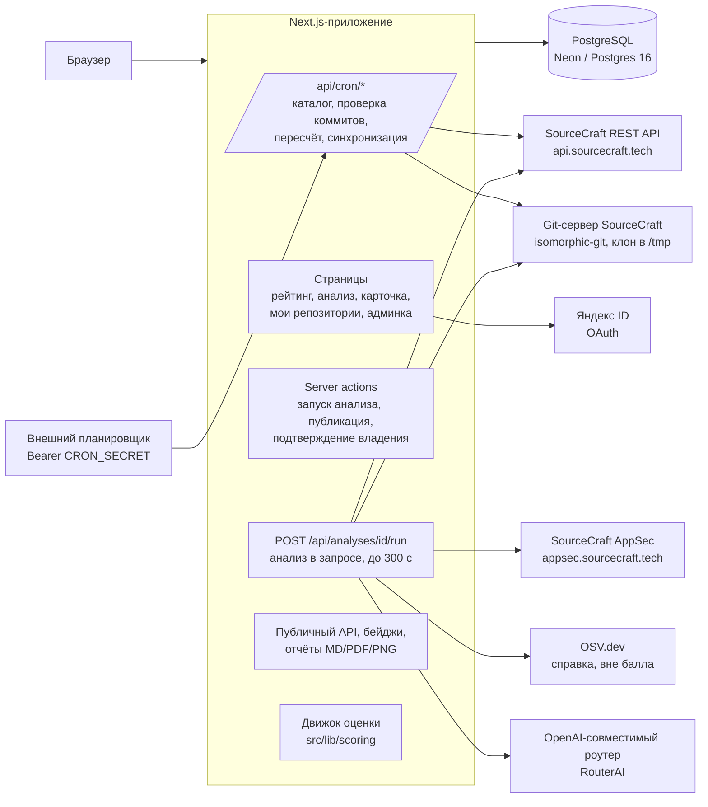
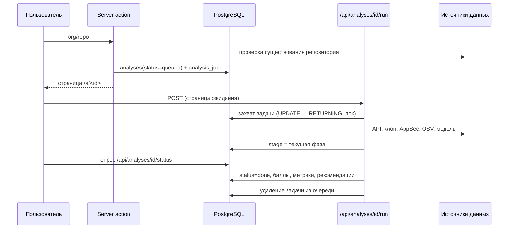

# Архитектура

## 1. Обзор

Pulse — веб-приложение на Next.js 15 (App Router, TypeScript). Интерфейс, серверная логика
и HTTP API находятся в одном приложении. Данные хранятся в PostgreSQL. Анализ репозитория
выполняется внутри HTTP-запроса отдельной serverless-функцией. Постоянно работающий сервер
для анализа не требуется.

Поддерживаются два варианта развёртывания с одним и тем же кодом:

| Вариант | Состав | Где выполняется анализ |
|---|---|---|
| Vercel (демонстрационный стенд) | serverless-функции Vercel с Fluid compute, Postgres в Neon, внешний планировщик HTTP-запросов | функция `POST /api/analyses/<id>/run`, до 300 с на анализ |
| Docker Compose | Postgres 16, приложение, воркер очереди, Caddy (TLS) | воркер `pnpm worker` и та же функция |

## 2. Компоненты

| Компонент | Расположение | Назначение |
|---|---|---|
| Страницы | `src/app/**/page.tsx` | рейтинг, страница анализа, карточка репозитория, «Мои репозитории», профили, статьи, админка |
| Server actions | `src/app/actions/` | запуск анализа с проверкой лимитов, публикация, подтверждение владения, pull request с правками |
| Исполнитель анализа | `src/app/api/analyses/[id]/run/route.ts`, `src/lib/analysis/run.ts` | захват задачи, сбор фактов, ИИ, расчёт, запись результата |
| Сбор фактов | `src/lib/collect.ts` | API SourceCraft, клон, чтение файлов, история, AppSec, OSV |
| Git | `src/lib/git/` | клон isomorphic-git, индекс файлов, метрики кода, история коммитов |
| Безопасность | `src/lib/security/` | клиент AppSec (балл), разбор lock-файлов и OSV (справка) |
| Слой ИИ | `src/lib/ai/` | провайдер, кэш, учёт расходов, месячный бюджет, задачи модели |
| Движок оценки | `src/lib/scoring/` | метрики, агрегация, штрафы, рекомендации; чистые функции с тестами |
| Плановые задачи | `src/app/api/cron/*`, `src/worker/run.ts` | каталог, проверка коммитов, пересчёт, синхронизация токенов |
| Публичный API | `src/app/api/public/*`, `src/app/api/badge`, `src/app/api/card` | рейтинг, отчёты, бейджи |
| Схема БД | `src/db/schema.ts`, `drizzle/` | 18 таблиц, миграции drizzle-kit |

## 3. Жизненный цикл анализа

Фазы, которые видит пользователь (колонка `analyses.stage`): постановка в очередь, опрос API,
клонирование, построение карты файлов, чтение исходников, разбор истории, проверка
зависимостей, работа модели, расчёт оценки. Фаза хранится в базе, поэтому после обновления
страницы прогресс не сбрасывается.

**Очередь и блокировки.** Таблица `analysis_jobs` служит журналом и блокировкой. Задачу
захватывает один исполнитель атомарным `UPDATE … RETURNING`. Блокировка старше 6 минут
считается брошенной, задачу можно захватить повторно. После трёх неудачных попыток анализ
получает статус `failed` с текстом причины. Воркер Docker-варианта выбирает задачи через
`FOR UPDATE SKIP LOCKED` и продлевает блокировки heartbeat-ом.

**Ограничение времени.** Сбор фактов ограничен 240 с, у каждой фазы свой дедлайн. Часть,
не уложившаяся в дедлайн, возвращает собранное и отмечается в списке пробелов анализа.

## 4. Данные

| Таблица | Содержимое |
|---|---|
| `users`, `accounts`, `sessions`, `verification_tokens` | пользователи и сессии Auth.js (пароль argon2id, Яндекс ID) |
| `repositories` | карточка репозитория: слаги, язык, описание, ветка по умолчанию, признак приватности |
| `catalog_repositories` | полный публичный каталог SourceCraft (`GET /repos`): лайки, дата активности, признаки форка, зеркала, шаблона |
| `analyses` | анализы: статус, фаза, балл, категории, метрики и факты (jsonb), рекомендации, пробелы, публикация, время |
| `analysis_jobs` | очередь и блокировки анализов |
| `commit_checks` | плановые проверки новых коммитов: результат, верхушка ветки, ссылка на переоценку |
| `owned_repositories` | подтверждённые владельцем репозитории |
| `sourcecraft_tokens` | личные токены SourceCraft, зашифрованные AES-256-GCM |
| `improvement_proposals` | подготовленные правки для pull request |
| `analysis_ratings`, `analysis_comments` | оценки анализа пользователями и комментарии |
| `ai_calls`, `ai_cache` | журнал вызовов модели с расходами и кэш ответов |
| `settings` | настройки администратора: модель, бюджет, лимиты, флаги плановых задач |
| `events` | журнал событий для админки |

Исходный код репозиториев в базе не хранится. Хранятся вычисленные факты: счётчики, пути,
флаги наличия файлов, текст README, фрагменты выборки для ревью в составе фактов анализа.

## 5. Авторизация и доступ

| Роль | Как входит | Что доступно |
|---|---|---|
| Гость | без входа | рейтинг, опубликованные анализы, публичный API, оценка публичного репозитория через `/api/public/analyze` с ограничением частоты |
| Пользователь | Яндекс ID или почта и пароль (Auth.js v5) | запуск анализа (10 в сутки, 3 одновременно), публикация своих анализов, профиль, комментарии |
| Владелец репозитория | пользователь + личный токен SourceCraft с ролью admin или maintainer в репозитории | «Мои репозитории», приватные репозитории, личная оценка с AppSec и прогонами CI, pull request с правками |
| Администратор | отдельный вход `/admin/login` (argon2id, HMAC-cookie, 5 попыток за 15 минут) | очередь, каталог, проверка коммитов, пользователи, модерация, настройки |

Правила для закрытых данных:

- приватный репозиторий оценивается только токеном его владельца;
- результат приватного репозитория никогда не публикуется: нет в рейтинге, бейдже,
  публичном API и на публичных страницах;
- страница непубличного анализа отдаёт 404 всем, кроме автора анализа;
- код приватного репозитория не отправляется во внешнюю модель и в OSV.dev.

## 6. Плановые процессы

| Процесс | Периодичность | Точка входа |
|---|---|---|
| Обход каталога SourceCraft | раз в `CATALOG_SYNC_HOURS` (24 ч) | `/api/cron/catalog`, воркер |
| Проверка новых коммитов у оценённых репозиториев | 00:00 и 12:00 МСК | `/api/cron/commit-check`, воркер, кнопка в админке |
| Пересчёт публичных оценок, изменившихся по данным каталога | ежечасно | `/api/cron/refresh-public`, воркер |
| Оценка неоценённых репозиториев каталога | по кнопке «Старт» в админке | `/api/cron/catalog-run` |
| Суточный пересчёт подтверждённых репозиториев владельцев | 00:00 по `BADGE_REFRESH_TZ` | `/api/cron/refresh-badges`, воркер |
| Синхронизация репозиториев по сохранённым токенам | каждые 5 минут | `/api/cron/sync-tokens`, воркер |

Подробно — в [scaling.md](scaling.md).

## 7. Технологии

| Слой | Технологии |
|---|---|
| Приложение | Next.js 15 (App Router), React 19, TypeScript strict |
| Интерфейс | Tailwind CSS, собственные компоненты, SVG-анимации |
| Данные | PostgreSQL (Neon или Postgres 16), Drizzle ORM, drizzle-kit |
| Валидация | Zod для всех внешних данных: ответов API, ответов модели, форм |
| Git | isomorphic-git (чистый JavaScript, без системного git) |
| Авторизация | Auth.js v5: Credentials (argon2id), Яндекс ID |
| Отчёты | next/og (satori, resvg) для PNG, pdf-lib для PDF |
| Тесты | Vitest: движок оценки и парсеры |
| Хостинг | Vercel с Fluid compute или Docker Compose |
